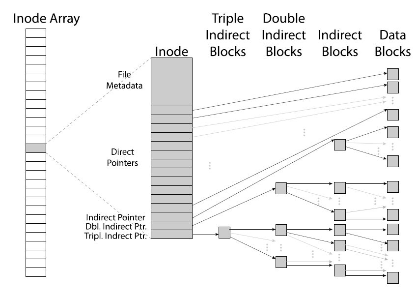

<div dir='rtl'>

تمرین گروهی ۳ - مستند طراحی
======================

گروه
-----

>>‫نام و آدرس پست الکترونیکی اعضای گروه را در این قسمت بنویسید.

یاشار ظروفچی <yasharzb@chmail.ir>

صبا هاشمی <sba.hashemii@gmail.com> 

امیرمحمد قاسمی <ghasemiamirmohammad@yahoo.com> 

مهرانه نجفی <najafi.mehraneh@gmail.com> 


مقدمات
----------

>>‫ ‫‫اگر نکات اضافه‌ای در مورد تمرین یا برای دستیاران آموزشی دارید در این قسمت  ‫بنویسید.

>>‫ لطفا در این قسمت تمامی منابعی (غیر از مستندات Pintos، اسلاید‌ها و دیگر منابع‫ ‫درس) را که برای تمرین از آن‌ها استفاده کرده‌اید در این قسمت بنویسید.

بافر کش
============

داده‌ساختار‌ها و توابع
---------------------

>>‫ در این قسمت تعریف هر یک از `struct` ها، اعضای `struct` ها، متغیرهای سراسری یا ایستا، `typedef` ها یا `enum` هایی که ایجاد کرده‌اید یا تغییر داده‌اید را‫ بنویسید و دلیل هر کدام را در حداکثر ۲۵ کلمه توضیح دهید.

الگوریتم‌ها
------------

>>‫ توضیح دهید که الگوریتم مورد استفاده‌ی شما به چه صورت یک بلاک را برای جایگزین ‫ شدن انتخاب می‌کند؟

>>‫ روش پیاده‌سازی `read-ahead` را توضیح دهید.

همگام سازی
-------------

>>‫ هنگامی که یک پردازه به طور مستمر در حال خواندن یا نوشتن داده در یک بلاک بافرکش‫ می‌باشد به چه صورت از دخالت سایر پردازه‌ها جلوگیری میشود؟

>>‫ در حین خارج شدن یک بلوک از حافظه‌ی نهان، چگونه از پروسه‌های دیگر جلوگیری می‌شود تا‫ به این بلاک دسترسی پیدا نکنند؟

منطق طراحی
-----------------

>>‫ یک سناریو را توضیح دهید که از بافر کش، `read-ahead` و یا از `write-behind` استفاده کند.

فایل‌های قابل گسترش
=====================

داده‌ساختار‌ها و توابع
---------------------

>>‫ در این قسمت تعریف هر یک از `struct` ها، اعضای `struct` ها، متغیرهای سراسری‫ یا ایستا، `typedef` ها یا `enum` هایی که ایجاد کرده‌اید یا تغییر داده‌اید را بنویسید و‫ دلیل هر کدام را در حداکثر ۲۵ کلمه توضیح دهید.

<div dir='ltr'>

```c
struct inode_disk
{
    off_t length;
    unsigned magic;
    int type;
    block_sector_t direct_blocks[16];
    block_sector_t indirect_block;
    block_sector_t double_indirect_block;
    uint32_t unused[100];
};

struct pointer_block 
{
    block_sector_t blocks[BLOCK_SECTOR_SIZE / 4];
};

struct inode 
{
    ...
    struct lock *access_lock; // lock for read/write synchronization
}
  ```

</div>

استراکت `inode_disk` را به صورت بالا تغییر می‌دهیم.
درواقع این استراکت حاوی تمامی اطلاعات مربوط به یک فایل (با دایرکتوری) و داده‌های مربوط به آن در دیسک است. به صورت کلی رویه‌ی چینش بلوک‌های داده از شکل زیر پیروی می‌کند.




 برای اینکه برای نگه‌داری و دسترسی به فایل‌ها با اندازه‌ی کوچک مجبور نباشیم از روی اشاره‌گرها حرکت کنیم و سرعت دسترسی بیشتر شود، ۱۶ بلوک مستقیم در استراکت جا داده‌ایم که هر کدام در سکتوری مجزا با حافظه‌ی ۵۱۲ بایت هستند. در صورتی که فایلی از این حجم بیشتر نیاز داشته  باشد، در وهله‌ی اول از یک اشاره‌گر غیر مستقیم که دارای ۱۲۸ بلوک است استفاده می‌کنیم. در صورتی که فایل به فضای بیشتری نیاز داشته باشد از یک اشاره‌گر غیر مستقیم دو مرحله‌ای استفاده می‌کنیم که دارای ۱۲۸ اشاره‌گر غیر مستقیم است.

بعلاوه، با توجه به اینکه `inode` هم می‌تواند نشان‌دهنده‌ی یک فایل و هم یک دایرکتوری باشد، برای استفاده صحیح از توابع مختلف مربوط به هر کدام از این دو نیاز داریم بدانیم `inode` ای فعلی مربوط به فایل یا نشان‌دهنده‌ی یک دایرکتوری است. این ویژگی را با `type` در استراکت بالا مشخص می‌کنیم.


>>‫ بیشترین سایز فایل پشتیبانی شده توسط ساختار inode شما چقدر است؟

حافظه‌ی موجود در استراکت شامل قسمت‌های زیر است:

۱) ۱۶ بلوک سکتور مستقیم

<div dir ='ltr'>

```c
  memory += 16*512
```
</div>

یعنی افزایش ظرفیت به اندازه‌ی ۸ کیلوبایت.

۲) یک اشاره‌گر غیر مستقیم دارای ۱۲۸ بلوک سکتور مستقیم

<div dir ='ltr'>

```c
  memory += 128*512
```
</div>

یعنی افزایش ظرفیت به اندازه‌ی ۶۴ کیلوبایت.

۳) یک اشاره‌گر غیر مستقیم دو مرحله‌ای دارای ۱۲۸ اشاره‌گر غیر مستقیم

<div dir ='ltr'>

```c
  memory += 128*128*512
```
</div>

یعنی افزایش ظرفیت به اندازه‌ی ۸۱۹۲ کیلوبایت (۸ مگابایت)

پس بیشترین سایز فایل پشتیبانی شده ۸.۰۷۰۳ مگابایت است.  

همگام سازی
----------

>>‫ توضیح دهید که اگر دو پردازه بخواهند یک فایل را به طور همزمان گسترش دهند، کد شما چگونه از‫ حالت مسابقه جلوگیری می‌کند.

<div dir="rtl">
 برای این که دو پردازه همزمان با دسترسی به یک `inode` یکسان، نتوانند عملیات‌های خطرناک (مانند نوشتن توسط یکی و خواندن دیگری از یک فایل، یا نوشتن هم‌زمان دو پردازه در یک فایل و از این دست اتفاقات) انجام دهند، یک قفل به نام `access_lock` برای هر `inode` تعریف کرده ایم، با مدیریت این قفل می‌توانیم برخی عملیات‌های سالم، مانند خواندن از دو فایل روی سکتور‌های مختلف،  را هم‌زمان و بهتر از گذشته انجام دهیم و همچنان از رخ‌دادن اتفاقات مخرب جلوگیری کنیم.
</div>

>>‫ فرض کنید دو پردازه‌ی A و B فایل F را باز کرده‌اند و هر دو به end-of-file اشاره کرده‌اند.‫ اگر  همزمان A از F بخواند و B روی آن بنویسد، ممکن است که A تمام، بخشی یا هیچ چیز از‫ اطلاعات نوشته شده توسط B را بخواند. همچنین A نمی‌تواند چیزی جز اطلاعات نوشته شده توسط B را‫ بخواند. مثلا اگر B تماما ۱ بنویسد، A نیز باید تماما ۱ بخواند. توضیح دهید کد شما چگونه از‫ این حالت مسابقه جلوگیری می‌کند.


<div dir="rtl">
در ابتدای توابع inode_read_at و inode_write_at سعی میکنیم قفل آن inode را بدست آوریم. در انتهای این توابع قفل آن inode را آزاد میکنیم بنابراین در هر لحظه یکی از ریسه ها در حال عمل روی یک inode و به طبع سکتور های مربوط به آن inode است و بنابراین این حالت مسابقه و تمام حالت های مسابقه‌ی اینچنینی به وجود نمی‌آید.
</div>

>>‫ توضیح دهید همگام سازی شما چگونه "عدالت" را برقرار می‌کند. فایل سیستمی "عادل" است که‫ خواننده‌های اطلاعات به صورت ناسازگار نویسنده‌های اطلاعات را مسدود نکنند و برعکس. بدین ترتیب‫ اگر تعدادی بسیار زیاد پردازه‌هایی که از یک فایل می‌خوانند نمی‌توانند تا ابد مانع نوشده شدن‫ اطلاعات توسط یک پردازه‌ی دیگر شوند و برعکس.

منطق طراحی
----------

>>‫ آیا ساختار `inode` شما از طبقه‌بندی چند سطحه پشتیبانی می‌کند؟ اگر بله، دلیل خود را برای‫ انتخاب این ترکیب خاص از بلوک‌های مستقیم، غیر مستقیم و غیر مستقیم دوطرفه توضیح دهید.‌‫ اگر خیر، دلیل خود برای انتخاب ساختاری غیر از طبقه‌بندی چند سطحه و مزایا و معایب ساختار‫ مورد استفاده خود نسبت به طبقه‌بندی چند سطحه را توضیح دهید.

<div dir="rtl">
از طراحی چند سطحه استفاده شده است. یک inode خود مستقیما به ۱۶ سکتور اشاره میکند و این باعث میشودبرای فایل های خیلی کوچک لازم نباشد که از سکتوری اضافه (همان سکتوری که خود به ۱۲۸ سکتور دیگر اشاره میکند) استفاده کنیم. به این ترتیب فضای کمتری از دیسک اشغال خواهیم کرد.
</div>

زیرمسیرها
============

داده‌ساختار‌ها و توابع
---------------------

>>‫ در این قسمت تعریف هر یک از `struct` ها، اعضای `struct` ها، متغیرهای سراسری‫ یا ایستا، `typedef` ها یا `enum` هایی که ایجاد کرده‌اید یا تغییر داده‌اید را بنویسید و‫ دلیل هر کدام را در حداکثر ۲۵ کلمه توضیح دهید.

به داده ساختار ترد فیلد زیر را اضافه می‌کنیم:

<div dir="ltr">

```c
struct thread 
{
    ...
    struct dir *working_directory;
}
  ```
</div>

از این فیلد برای ذخیره‌ی پوشه‌ی کار پردازه استفاده می‌کنیم.

الگوریتم‌ها
-----------

>>‫ کد خود را برای طی کردن یک مسیر گرفته‌شده از کاربر را توضیح دهید.‫ آیا عبور از مسیرهای absolute و relative تفاوتی دارد؟

در تابع `lookup` مسیر گرفته شده را توسط `/` جداسازی می‌کنیم و سپس به ترتیب دنبال فایل یا دایرکتوری داده شده می‌گردیم و در هر مرحله چک می‌کنیم که entry پیدا می‌شود یا خیر و اگر پیدا شد با استفاده از `type` در داده ساختار `inode` چک می‌کنیم که اگر در مسیر میانی بود حتما دایرکتوری باشد.

همگام سازی
-------------

>>‫ چگونه از رخ دادن race-condition در مورد دایرکتوری ها پیشگیری می‌کنید؟‫ برای مثال اگر دو درخواست موازی برای حذف یک فایل وجود داشته باشد و ‫ تنها یکی از آنها باید موفق شود یا مثلاً دو ریسه موازی بخواهند فایلی‫ یک اسم در یک مسیر ایجاد کنند و مانند آن.‫ آیا پیاده سازی شما اجازه می‌دهد مسیری که CWD یک ریسه شده یا پردازه‌ای‫ از آن استفاده می‌کند حذف شود؟ اگر بله، عملیات فایل سیستم بعدی روی آن‫ دایرکتوری چه نتیجه‌ای می‌دهند؟ اگر نه، چطور جلوی آن را می‌گیرید؟

منطق طراحی
-----------------

>>‫ توضیح دهید چرا تصمیم گرفتید CWD یک پردازه را به شکلی که طراحی کرده‌اید‫ پیاده‌سازی کنید؟

### سوالات نظرسنجی

پاسخ به این سوالات دلخواه است، اما به ما برای بهبود این درس در ادامه کمک خواهد کرد.

نظرات خود را آزادانه به ما بگوئید—این سوالات فقط برای سنجش افکار شماست.

ممکن است شما بخواهید ارزیابی خود از درس را به صورت ناشناس و در انتهای ترم بیان کنید.

>>‫ به نظر شما، این تمرین گروهی، یا هر کدام از سه وظیفه آن، از نظر دشواری در چه سطحی بود؟ خیلی سخت یا خیلی آسان؟

>> چه مدت زمانی را صرف انجام این تمرین کردید؟ نسبتا زیاد یا خیلی کم؟

>>‫ آیا بعد از کار بر روی یک بخش خاص از این تمرین (هر بخشی)، این احساس در شما به وجود آمد که اکنون یک دید بهتر نسبت به برخی جنبه‌های سیستم عامل دارید؟

>>‫ آیا نکته یا راهنمایی خاصی وجود دارد که بهتر است ما آنها را به توضیحات این تمرین اضافه کنیم تا به دانشجویان ترم های آتی در حل مسائل کمک کند؟

>> متقابلا، آیا راهنمایی نادرستی که منجر به گمراهی شما شود وجود داشته است؟

>>‫ آیا پیشنهادی در مورد دستیاران آموزشی درس، برای همکاری موثرتر با دانشجویان دارید؟

این پیشنهادات میتوانند هم برای تمرین‌های گروهی بعدی همین ترم و هم برای ترم‌های آینده باشد.

>>‫ آیا حرف دیگری دارید؟

</div>
