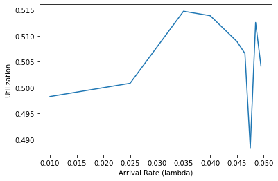

<div dir="rtl" align="justify">

# تمرین گروهی ۲ - گزارش نهایی

گروه
-----

یاشار ظروفچی <yasharzb@chmail.ir>

صبا هاشمی <sba.hashemii@gmail.com> 

امیرمحمد قاسمی <ghasemiamirmohammad@yahoo.com> 

مهرانه نجفی <najafi.mehraneh@gmail.com> 


زنگ ساعت دار بهینه
================

همانطور که در مستند طراحی عنوان شد، پیاده‌سازی به این صورت است که بدون علاف شدن برنامه سر یک ریسه‌ی خاص یا به عبارتی همان `busy_waiting` به صورت منطقی بررسی کنیم ببینیم که از زمان خواب هر ریسه گذشته است یا خیر. در صورت اینکه گذشته باشد وی را بیدار کنیم.
به این منظور دو فیلد به ساختار `thread` اضافه شدند. یکی `target_ticks` که تیک نهایی ریسه (یعنی زمانی که باید بیدار شود نسبت به `timer`) و دیگری `alarm_elem` که نماینده‌ی ریسه در لیست ریسه‌های درحال انتظار است.
ابتدا به تغییرات تابع `timer_sleep` اشاره می‌کنیم که تکه‌ی حلقه‌ی `while` آن حذف شده و تابع `thread_push_block` را در آن صدا می‌زنیم. همچنین به انتهای تابع `timer_interrupt`  نیز تابع `thread_pop_block` اضافه شده است که ریسه‌های آماده را بیدار می‌کند.
امضای توابع یاد شده به صورت زیر است

<div dir="ltr">

```c
void thread_push_block(struct thread *t);
```

```c
void thread_pop_unblock();
```
</div>

در تابع اول به صورت مرتب شده یک ریسه وارد لیست انتظار می‌شود. جهت تعریف مفهوم ترتیب، تابع زیر در `thread.c` پیاده‌سازی شده است

<div dir="ltr">

```c
bool cmp_target_ticks(const struct list_elem *a, const struct list_elem *b, void *aux);
```
</div>

خروجی این تابع `bool` است که البته در ساختار `list` یک تعریف نوع انجام شده به نام `list_less_func` که از همین نوع `bool` است.
پس از عمل `list_insert_ordered` ریسه را با تابع `thread_block` تغییر وضعیت می‌دهیم.
در تابع دوم، روی ریسه‌هایی موجود در لیست پیمایش می‌کنیم. هر کدام اگر وضعیت `THREAD_BLOCKED` داشتند و از زمان مقررشان گذشته بود ابتدا `thread_unblock` می‌کنیم و سپس از لیست حذف می‌شوند.

زمان‌بند اولویت‌دار
============================

آزمایشگاه زمان‌بندی
================
۱. 
پیاده‌سازی کردن شبیه‌ساز زمان‌بندی:

در دفتر ژوپیتر!

________________

۲. به سوی بهره‌وری ۱۰۰ درصد!

آ) 

 ب) فاصله‌ی زمانی بین ورود دو فعالیت متوالی طبق تعریف از توضیع نمایی تبعیت میکند. امیدریاضی متغیر تصادفی نمایی با پارامتر y برابر یک به روی y است. به همین دلیل y باید برابر یک بر روی M باشد.


ج)
نمودار زیر را نگاه کنید. در محور افقی lambda یا پارامتر توزیع نمایی قرار دارد و محور عمودی درصد بهره‌وری است. برای این نمودار از مقدار M = 0.5/y برای تمام y ها استاده شده که نشانگیر این است که برای داشتن بهر‌وری ۵۰ درصدی، لازم است تا طول فعالیت یک پردازه نصف میانگین زمان بین ورود دو فعالیت باشد. البته که حدس ما نیز چنین بود و داده‌های بدست آمده از شبیه سازی نیز این حدس را تایید میکنند.

</img>

د)
نمودار در دفتر ژوپیتر!

ه) بدیهی است که با افزایش y،‌زمان بین ورود دو فعالیت که با مقدار y رابطه عکس دارد کاهش میابد. یعنی پردازنده فرصت کمتری برای استراحت بین فعالیت‌ها دارد و بنابراین بهره‌وری بالاتر است. به همین ترتیب نیز  زمان پاسخگویی افزایش میابد زیرا  فعالیت ها زودتر ظاهر میشوند اما مقدار کار پردازنده در هر واحد زمانی یکسان است. پس فاصله بیشتری بین ورود یک فعالیت و زمان پایان آن خواهیم داشت و این یعنی زمان پاسخ‌گویی بیشتر.

و)


ز)  البته پاسخ این قسمت بستگی دارد به نحوه مدلسازی ما از ظاهر شدن فعالیت ها. در حقیقت اگر بپذیریم که ظهور فعالیت ها از توزیع پوآسن پیروی میکنند (در نتیجه ظهور یک فعالیت بعد از دیگری مطابق توزیع نمایی  است که در صورت سوال داریم) برای افزایش بهره‌وری باید زمان ورود بین فعالیت ها کاهش بیابد و این بعنی افزایش زمان پاسخگویی. زیرا فعالیت ها زود و پشت سر هم ظاهر میشوند ولی دیر به اتمام میرسند. البته این موضوع خیلی بستگی به تعداد فعالیت ها دارد. مثلا اگر فرض کنیم به صورت میانگین هر دو فعالیت با فاصله ۲۰ واحد ظاهر میشوند و طول هر فعالیت ۲۵ واحد باشد، یعنی پردازنده در هر فعالیتی که انجام میدهد در واقع ۵ واحد تاخیر به تاخیر هایش اضافه میشود و این تاخیر در زمان پاسخ گویی  فعالیت ‌هایی که دیر تر ظاهر شده‌اند تاثیر بیشتری میگذارد تا فعالیت‌هایی که در ابتدا ظاهر شده اند. این استدلال نیز توسط نمودار تایید میشود. اگر دقت کنیم، شیب نمودار زمان پاسخ‌گویی برای صدک ۹۵ بیشتر از شیب نمودار میانه زمان پاسخ‌گویی است.


میزان مشارکت
================

</div>